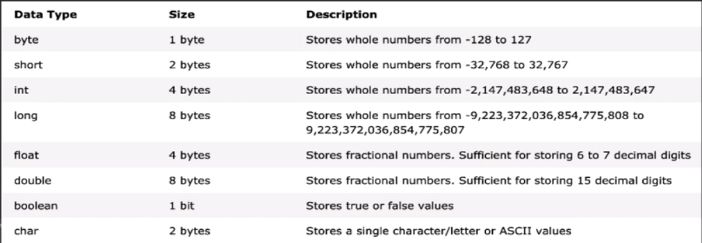

# What is Java?

Java is an object Oriented Programming (OOP)  programming language. 

### What is a Programming Language?

Programming languages are broadly classified into three levels: **machine languages**,
**assembly languages**, and **high-level languages**.

* Machine languages - is the only programming language the CPU understands. example `10110011`

* Assembly language - which allows
  “higher-level” symbolic programming. Instead of writing programs as a sequence
  of bits, assembly language allows programmers to write programs by using symbolic operation codes. For example, instead of 10110011 , we use MV to move the
  contents of a memory cell into a register. Since programs written in assembly language are not recognized by the CPU,
  we use an assembler to translate programs written in assembly language into
  machine-language equivalents. Compared to writing programs in machine language, writing programs in assembly language is much faster, but not fast enough
  for writing complex programs.

* High-level-language - were developed to enable programmers to write pro-
  grams faster than when using assembly languages. A programming language intended for mathematical computation, allows programmers to express numerical equations directly as
  X = (Y + Z) / 2

  Since programs written in a high-level language are not recognized by the CPU, we must use a compiler to translate them to assembly language equivalents.


## What is OOP?

In object oriented style every is regarded as class and a class is a blue-print in which an object is created. An object is a thing both tangible and intangible, an object is a instance of a class, once is a class is defined many objects can be created from it meaning we can many of that instance.


## Software Engineering and Software Life Cycle

When we say computer programming, we are referring not only to writing Java
commands, but also to a whole process of software development. Knowing a programming language alone is not enough to become a proficient software developer. You must know how to design a program.

The sequence of stages from conception to operation of a program is called the ***software life cycle*** , and ***software engineering*** is the application of a systematic and disciplined approach to the development, testing, and maintenance of a program.

#### Software Life Cycle :

These is divided into five major phase

1.  Analyzing Stage 
2. Design
3. Code
4.  Test
5. Maintain 

## Variable & Types

Variables: Let say we want to compute the sum and difference of two number. For example x and y. In mathematics we would write it like this

```mathematica
//the sum 
x + y
//the difference
x - y
```

When comes to Java it is a different case, before we compute the sum and difference we most the type know the data-type that will hold their value. In Java we have many data-types that we use for different use cases. 

```java
//variable declaraion 
int x, y;
```

#### Java Variable

A variable is a location in memory(storage area) to hold data. Each variable in your program should have a unique name.

**Data Types**: Java is type language and strict type for that matter, before we declare a variable we most first define the type (data-type). Data type is unlike a variable name, data-type is part of the language itself, and cannot be any other name expect that which the language defines and as for a variable it could be any name but it is also advisable to give your variable a meaningful name.

## Two Types of Data Types

**Primitive Data Types**: These are data type that contain only a value

```java
//Primitive Data Type
String name = "Fatou";
int age = 14;
byte myByte = 1234;
double  money = 200.50;
boolean isMarriage = false;
char gender = 'F';
long myLong = 40095L;
float myFloat = 23990F;
short myShort = 12.30;
```



**Non Primitive(Referential) Data Types**: This include *object* they have name, properties and behaviors. All classes are reference type and any other are primitives type

```java
//Non primitive Data Type
String name = new String(original: "fatou"); //fatou
name.toUpperCase() // FATOU
Date today = new Date();
```

Two stages of varaibles:

```java
//defined a variable
int number = 4;
//declear a variable
double mark;
```

## Operators

Operator are symbol that allow us to perform operations on variable and values.

Operator and a operand:

```java
//operator act on operands(=,+,-,/,*,%,<,!=,?)
double sum = 2 * 4;//operands(sum, 2, 4)

```

In Java we have 5 difference type:

1. Arithmetic Operators
2. Assignment Operators
3. Relational/Comparison Operators
4. Logical Operators
5. Unary Operators
6. Ternary Operators

### Arithmetic Operator

Most programs perform arithmetic calculations. The arithmetic operators are summarized in below. Note the use of various special symbols not used in algebra. The asterisk( * ) indicates multiplication, and the percent sign ( % ) is the remainder operator(modulos), which we’ll discuss shortly. The arithmetic operators in Fig. 2.11 are binary operators, because each operates on two operands. For example, the expression f + 7 contains the binary operator + and the two operands f and 7 .


| Java Operation    | Operator | Algebraic expression | Java expression |
| ----------------- | :------: | :------------------: | :-------------: |
| Additional        |    +     |        f + 7         |      f + 7      |
| Subtraction       |    -     |        p - c         |      p - c      |
| Multiplication    |    *     |          bm          |      b * m      |
| Division          |    /     |        x / y         |      x / y      |
| Remainder/modulos |    %     |       r mod s        |      r % s      |

```java
//examples of arithmetic operators
//additional operator
int a = 2, b = 5;
int sum = a + b;// 7

//subtraction operator
int a = 2, b = 5;
int sum = a - b;// 3

//multiplication operator
int a = 2, b = 5;
int sum = a * b;// 10

//division operator
int a = 2, b = 5;
int sum = a / b;// 2

//modulos operator
int a = 2, b = 5;
int sum = a % b;// 1

//parenthesesforGrouping subexprision
int num = a * (b + c);
//rule of precedence in java is almost the in algebra BODMAS
//Multiplication, division and remainder operations evaluate first
//Addition and subtraction operations are applied next
```

### Assignment Operators

Assignment operator is used to assign value to a variable

| Operator | Example | Equivalent to |
| -------- | ------- | ------------- |
| =        | a = b;  | a = b;        |
| +=       | a += b; | a = a + b;    |
| -=       | a -= b; | a = a - b;    |
| *=       | a *= b; | a = a * b;    |
| /=       | a /= b; | a = a / b;    |
| %=       | a %= b; | a = a % b;    |


```java
//example of assignment operators
String name = "Ebou";
double score = 78.30;
int counter;
counter + 1; //1
counter += 1; //2
counter -= 1; //1
counter *= 1; //1
```


### The Math Class

```java
System.out.println(Math.abs(-20)) // 20
System.out.println(Math.max(-20, 2)) // 2
System.out.println(Math.min(-20, 2)) // -20
System.out.println(Math.sqtr(25)) // 5    
```

### Equality And Relational(Comparison) Operators

Comparison operator compare two values and the result is a boolean(boolean expression)

| Name                      | Operator | Example  | Answer |
| :------------------------ | :------: | :------: | :----: |
| Equals to                 |    ==    |  2 == 2  |  true  |
| Not equals to             |    !=    |  4 != 5  |  true  |
| Less than                 |    <     |  1 < 2   |  true  |
| Less than or equals to    |    <=    | 20 <= 21 | false  |
| Greater than              |    >     |  10 > 9  | false  |
| Greater than or equals to |    >=    | 20 >= 20 |  true  |
|                           |          |          |        |


```java
//more example
//equality operators
int a = b == c;
double a = b != c;
//relational operators
int two = 2;
int three = 3;
boolean isEqualsTo = two == three; // false
boolean isNotEqualsTo = two != three; // true
boolean isLessThan = two < three; // true
boolean isLessThanOrEqualsTo = two <= three; // true
boolean isGreaterThan = two > three; // false
boolean isGreaterThanOrEqualsTo = two >= three; // false

```

### Logical Operators

Logical operator allow us to combine multiples boolean expressions and return type is a boolean

#### The Truth Table

| Operator          | Example         | Example                                                |
| ----------------- | --------------- | ------------------------------------------------------ |
| && (Logical AND)  | exp1 && exp2    | both have to be true for it to evaluate to true        |
| \|\| (Logical OR) | exp1 \|\|  exp2 | one have to true for it to evaluate to true            |
| ! (Logical NOT)   | !exp            | if it was true it will evaluate to false else overwise |

```java
int a = 5, b = 3, c = 8, d = 2;
// example of &&
(a > b) && (c > d)// true
(a => b) && (c < d)// false

// example of ||
(a <= 5) || (c < d)// true
(a > b ) || (c => b)// true 
(a =< b) || (c < d)// false
    
//example of !
 !(a > b)// true
 !(a == d)// true
 !(c <= b)// false
```

## Unary Operators

Unary operator is used with only one operand

| Operator | Meaning                                                      |
| -------- | ------------------------------------------------------------ |
| +        | unary plus: not necessary to us since numbers are positive without using it |
| -        | unary minus: inverts the sign of an expression               |
| ++       | increment operator: increments value by 1                    |
| --       | decrement operator: decrement value by 1                     |
| !        | logical complement operator: inverts the boolean value of a boolean |

***Increment and Decrement operator*** 

```java
//increment ++
int num = 4;//4
++num// 5
    
//decrement --
int num = 4;//4
--num// 3
```

### Ternary Operator

The ternary operator(conditional operator) is short-hand for if and else statement

```java
//ternary operator
boolean isLiving = false
String status = isLiving ? "The man is alive" : "The man is death!";//The man is death!
```

## control Flow 

### If Else Statement

In Java we use the if ...else statement to run a block of code among other alternatives 

```java
// example
if(condition){
    //do something
}

double units = 20.40;
if(units <= 1.00){
    print("credit alter");
}

boolean isHappy = true;

if(isHappy){
    print("I am in the hood!");
}

if(!isHappy){
    print("I am not in the hood!");
}

//if and else
String password = "secret";
if(password.contains("secret")){
    print("Welcome!");
} else {
    print("Wrong credetials!");    
}

//in a student grading system where the grading are:
// 90 - 100 -> A
// 75 - 89 -> B
// 60 - 74 -- C
// 49 - 59 -- D
// 40 - 48 -- E
// 0 - 39 -- F

//in the above grades we can use if and else statement to print out whether the student is A, B or C student depending on the mark 

double mark = 75;
if (mark >= 90) {
	print("A student");
} else if (mark >= 70 && mark <= 89) {
	print("B student");
} else if (mark >= 60 && mark <= 74) {
	print("C student");
} else if (mark >= 49 && mark <= 59) {
	print("D student");
} else if (mark >= 40 && mark <= 48) {
	print("E student");
} else {
  print("Fail student");
}

```

