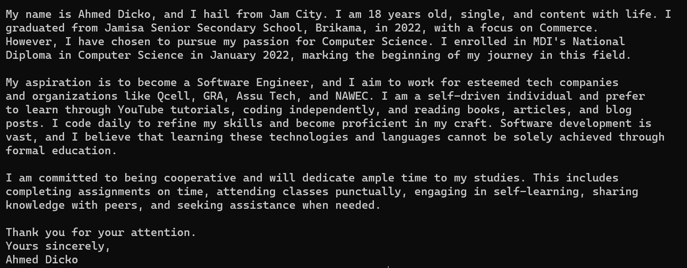

# Java Assignment 1

Take this chance to introduce yourself. Utilize the screenshot provided as a reference, and craft a brief essay detailing your background. Share a concise description about yourself, including the school you graduated from and the year. Explain your decision to enroll at MDI, and what drives you. Lastly, outline your ultimate objective and the steps you intend to take to achieve it.

Begin by crafting your essay. Then, generate print statements to showcase in the console. Each statement should be 20 to 21 words in length. Your task should involve multiple print statements rather than just one.

**Improve your writing:**

Once you've completed your essay, copy it. Then, head to [Grammarly](https://app.grammarly.com/), a free online grammar checker that will assist you in identifying and correcting any grammatical errors and ensuring your essay is properly structured.

**Submission:**

After completing your java1.assignment, use `Ctrl+A` in your IDE (IntelliJ) to select all your code. Then, open a Word document, create a new blank document, and paste the code. Finally, create a cover letter with your full name, student number, and email address.

**Sample Essay:**

Please refrain from copying and pasting my words, as doing so may result in penalties.

Happy code!