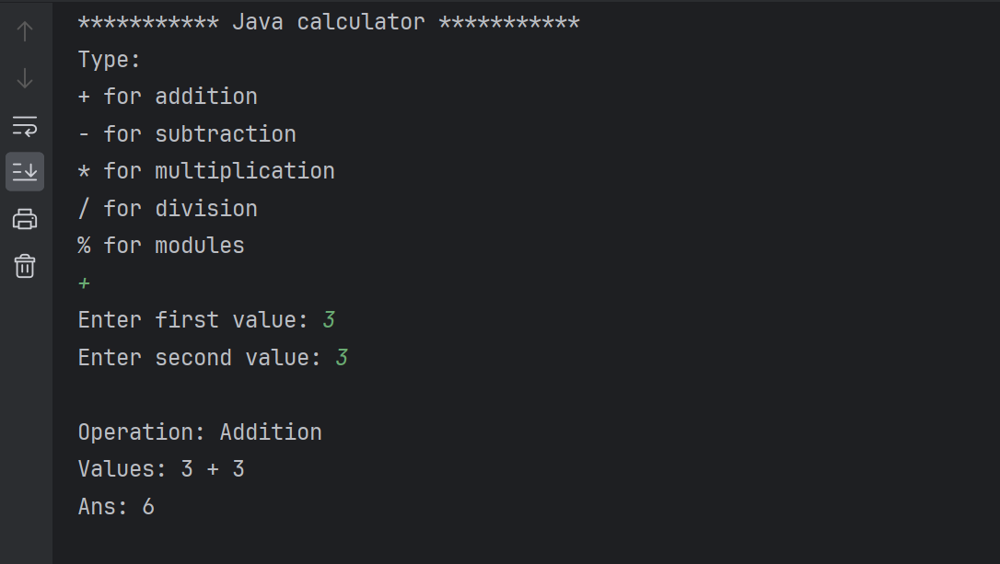

# Java Assignment 5

In this java1.assignment, you will utilize your critical thinking and coding skills to develop a calculator program using a Scanner object , a switch statement, and method:

**Scanner object:** To read from the user

**Switch statement:** To able to perform different operations based on the user's choice

**Method:** To create different Arithmetic operations(addition, subtraction, division, and modules)

Switch statements with different cases for different operations such as addition, subtraction, multiplication, division, and modules called or invoke respective methods into the appropriate case, and pass in the arguments into your method. The argument are the value the user entered using the Scanner object.

Your method should define two parameter of type int, compute the input parameters, store it into a variable called, and and return value to the called. 

Program Message: Your program should be able to inform the user's about the the type of operation they have performed, the computed values, and the answer. At the end of the data your program should look like the below screenshot:

Good Luck!