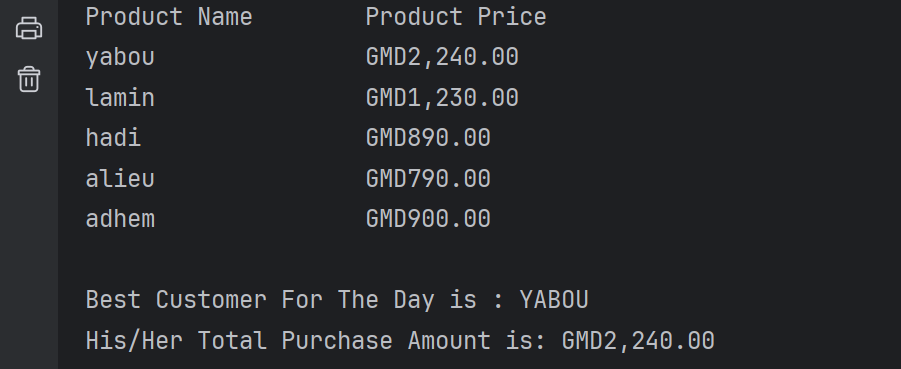

# Java One Project

### Supermarket Checkout Application

### Program Purpose

This program simulates a supermarket checkout system, allowing the owner to keep track of customer purchases, display the total sales at the end of the day, and identify the best customer (i.e., the one with the highest purchase amount). It handles user input for customer names and item prices, calculates total purchase amounts, and formats currency values for display. The program also includes error handling for incorrect price inputs and ensures that data entry continues smoothly.

**Class:** `SuperMarket`

The `SuperMarket` class simulates a simple point-of-sale system for a supermarket. It keeps track of customer purchases, displays the sales at the end of the day, and identifies the customer with the highest purchase amount.

These features collectively make the Supermarket application a comprehensive and user-friendly tool for managing sales and customer interactions in a retail environment.

### Features of the Supermarket Checkout Application

1. **Daily Operations**
   - **Operational Status Check**: Determine if the supermarket is open and continue operations accordingly.
   - **End-of-Day Summary**: Provide a summary of sales and highlight the best customer once the supermarket closes.
2. **Sales Operations** 
   - **Sales Management:** The program should allow users to input a customer's name, store it into the `customer name` list, and input the price of each item a customer buys(the program should continue doing so as long as the customer has some more product on the counter).
   - **Sum up Customer's Sale:** The program should be able to accumulate the total amount of what a particular customer has purchased and add the accrued amount to the `customerTotalPurchase` list.

3. **Sales Display**
   - **Display Cart Contents**: Print out the user the product names and their prices in a tabular format at the end of the day, making it easy to review sales.
4. **Best Customer Identification**
   - **Find Highest Purchase**: Identify and display the customer with the highest purchase amount for the day.
   - **Display the Best Customer:** Display the name of the best customer with his/her price.
5. **Currency Formatting**
   - **Format Prices**: Convert numerical price values into a properly formatted string with a GMD prefix, ensuring consistency and readability.
6. **User Interaction**
   - **Input Handling**: Gather customer names and item prices through user input, with error handling for incorrect price entries.
   - **Process Continuation**: Allow continuous processing of customer data until the user decides to stop.
7. **Error Handling**
   - **Input Validation**: Handle exceptions for invalid item price entries to maintain smooth operation.
8. **Scanner Integration**
   - **User Input Collection**: Use `Scanner` for collecting input from users in a simple and interactive manner.

Methods:

1. **AddCustomerToRecord:** This method takes two arguments namely; name of the customer and his/her associate accumulated price. Upon receiving the customer name and price the method the program should be able to store these values.
2. **DisplaySales:** This method prints out the product names and their corresponding prices in a tabular format at the end of the day. It iterates over the lists `customerName` and `customerPrice` to retrieve and display each product's details.
3. **GetTheIndexOfTheBestCustomer:** This method iterates over the list of customer prices to determine the highest price and returns the index of the customer associated with that price.
4. **CurrencyFormatter:** This method takes a double value representing a currency amount and formats it according to the US locale currency format. The resulting string representation of the currency amount will have a "GMD" prefix instead of the default "$" symbol used in the US locale. The method return a String representation like so `GMD1,250.00`.

Rubrics:

Your project will be marked according to the following:

1. A public class name `SupermarketCheckout` and a `main` method.
2. Your program should define an ArrayList to store the names of customers.
3. Your program also defines an ArrayList to store the accrued amount of a customer purchase.
4. Your program should include an iterative mechanisms:
   1. One that would allow users to interact with the program as long as they want to.
   2. Another one that will enable users to input customer purchase items until there are no more items.
5. A condition to kill the program at the end of the day and a condition to stop the user from inputting the customer's purchase item and proceed to processing another customer.
6. Your program should be well informative; each step a user is taking should prompted with a clear and precise message.
7. Your program should utilize the `Scanner` object to allow users to input from their keyboard.
8. Your program should handle exceptions grace by employing a try-and-catch block.
9. Your program should define a method that takes two parameters one of type String(name of the customer) and another of type double (accrued customer purchased). The method should then proceed to add the input parameters to their respective ArrayList.
10. Your program should define a method that iterates over the customer list and their accrued purchased amount. Remember the attached GMD for readability.
11. Your program should define a method that should be able to determine the best customer and return his/her index.
12. Your program should define a method that takes a double type; this parameter will be a monetary value that will be formatted accordingly and returned as a String.
13. Your program should be well documented; You have to provide comments for your method with a Java standard method/function documentation, other parts of your code should be documented as well.

A preview of the program at the end of the day, the list of the customers with their accrued purchase amount, and the customer and his/her accumulated amount:

Project Marking Scheme:

<table>
    <thead>
        <tr>
            <td>Activity</td>
            <td>Mark(%)</td>
    	</t>
    </thead>   
<tbody>
	<tr>
    <td>Code</td>
    <td>8%</td>
    </tr>
    <tr>
    <td>Docs</td>
    <td>5%</td>
    </tr> 
    <tr>
    <td>Presentation</td>
    <td>12%</td>
    </tr>
</tbody>
</table>
Happy codidng!
